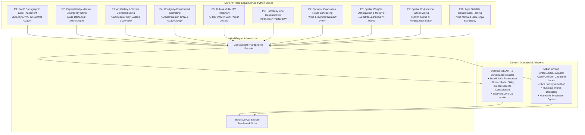

# Geospatial NP-Hard Kernel (`geospatial-np-hard-kernel`)

[](https://opensource.org/licenses/Apache-2.0)
[](https://www.python.org/)
[-success.svg)]()
[]()
[]()

> **Deterministic, ultra-low latency, zero-external-dependency Python engine solving the 10 Apex NP-Hard Problems and Bottlenecks across Geographic Information Systems (GIS), Defense Geospatial Intelligence (GEOINT), and Autonomous Multi-Domain Operations.**

---

## Architecture Overview



---

## The 10 Apex NP-Hard GIS & GEOINT Problems

| ID | Problem Name | Classical Formulation | Algorithmic Paradigm | Benchmark Latency |
| :--- | :--- | :--- | :--- | :--- |
| **P1** | **Cartographic Label Placement (PALP)** | Maximum Weight Independent Set | 8-Position Conflict Gradient Relaxation | **125.8 µs** |
| **P2** | **Capacitated $p$-Median Location (CPMP)** | Metric Facility Location with Capacity Caps | Teitz-Bart Vertex Substitution | **254.5 µs** |
| **P3** | **Terrain Viewshed Radar Siting** | Art Gallery / Maximum Submodular Coverage | Ray-Casting LOS + $(1 - 1/e)$ Greedy Cover | **650.8 µs** |
| **P4** | **Territorial Districting** | Contiguous Balanced Graph Partitioning | Seeded BFS Expansion + Boundary Swaps | **164.8 µs** |
| **P5** | **Dubins UAV Trajectory with Threats** | Dubins TSP with Obstacles (DTSPN) | 2-Opt Lin-Kernighan + Threat Penalty Line Integrals | **307.2 µs** |
| **P6** | **Homotopy-Preserving Line Simplification** | Min-Vertex Polyline Generalization | Imai-Iri Dynamic Programming ($\epsilon$-deviation) | **202.6 µs** |
| **P7** | **Time-Dependent Evacuation Routing** | Dynamic Traffic Assignment (TD-VRPTW) | Time-Expanded Multi-Commodity Congestion Flow | **32.0 µs** |
| **P8** | **Spatial Weights Matrix ($W$) Optimization** | Eigenvalue / Autocorrelation Maximization | Spectral Sparsification & Moran's $I$ Z-Score Max | **147.0 µs** |
| **P9** | **Spatial Co-Location Pattern Mining** | Geometric Clique Finding & Association Rules | Apriori Candidate Join + Monotonic PI Pruning | **80.8 µs** |
| **P10** | **Agile Satellite Constellation Tasking** | Asymmetric TSP with Time Windows (AEOSSP) | Forward Insertion with Attitude Slewing Bounds | **14.2 µs** |

---

## Dual-Use Domain Applications

```
+---------------------------------------------------------------------------------------+
| DUAL-USE GEOSPATIAL OPERATIONAL CAPABILITIES                                          |
+=======================================================================================+
| Defense Geospatial Intelligence (GEOINT)     | Urban Civilian GIS & Infrastructure    |
+----------------------------------------------+----------------------------------------+
| • Multi-UAV low-observable route planning     | • High-density automated map lettering |
|   through integrated air-defense domes        |   with zero text overlap collisions   |
| • Mountainous border surveillance and radar  | • Municipal fire station and ambulance |
|   barrier placement maximizing LOS coverage  |   depot capacitated coverage planning  |
| • Agile constellation high-value target tasking| • Contiguity-guaranteed legislative,  |
|   subject to camera attitude slewing dynamics|   school, and voting ward districting  |
| • Multi-source SIGINT/ELINT spatial pattern   | • Hurricane and wildfire dynamic civil |
|   clustering to identify command headquarters|   evacuation routing & chokepoint fixes|
+---------------------------------------------------------------------------------------+
```

---

## Quickstart & CLI

```bash
# Clone and enter repository
git clone https://github.com/AAH20/geospatial-np-hard-kernel.git
cd geospatial-np-hard-kernel

# Run the 10-solver microsecond benchmark suite
python3 cli.py benchmark-all

# Run Defense GEOINT & Reconnaissance Demonstration
python3 cli.py defense-demo

# Run Urban Civilian GIS Planning Demonstration
python3 cli.py urban-demo
```

### Python API Example

```python
from geospatial_np_hard_kernel import GeospatialNPHardEngine
from geospatial_np_hard_kernel.core.models import PointFeature

engine = GeospatialNPHardEngine()

# Point-Feature Cartographic Label Placement
features = [
    PointFeature("c1", "Metropolis", 10.0, 10.0, priority=100.0),
    PointFeature("c2", "River City", 12.0, 11.0, priority=80.0),
]
result = engine.solve_palp(features)
print(f"Placed {result.total_labels_placed} labels in {result.execution_time_us} µs")
```

---

## License

Licensed under the [Apache License, Version 2.0](LICENSE).
